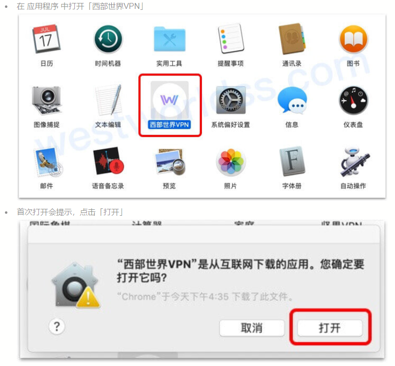

# mac电脑翻墙软件，详细的科学上网方法步骤

### Mac电脑的翻墙软件还不是太多，今天给大家推荐个我自己在用的，不管是上网速度还是界面的UI设计都很不错，如果你也在用mac电脑，那么不妨可以试一下这个软件。同时我也会用截图的形式给大家详细展示一下试用软件翻墙的步骤。

## 一、mac电脑翻墙软件官网

### 官网地址：[点击访问官网](https://xbsj3462.fun/i/ask068)

首先这个mac翻墙软件也有windows电脑以及苹果和安卓手机的客户端，都是可以通用下载的，并且一个账号能够同时在多平台使用，对于新注册的用户，还提供了三天的免费试用时间，容错率很高，建议大家可以把mac客户端的试用时间全部用完之后，再考虑是否继续付费使用。

## 二、mac 翻墙的详细步骤

接下来几步我会用截图的形式给大家展现出来，看完之后应该对于使用就没有什么问题了：

## 三、这款mac翻墙梯子软件的使用感受

对于一个新手来说，这款[mac梯子软件](https://github.com/gelangtai/mac-VPN/)翻墙的门槛比较低，不需要怎么配置，直接下载安装登录就可以使用，容易上手，而且线路节点也很丰富，网速也快。

其次就是节点的更新维护这块儿，作为长期使用的用户来说，能够获得比较好的使用体验和保障，毕竟mac梯子现在其实说实话好用的还是比较少的，好不容易找到一个就得使劲去用就行。

最后再说一点，对于很多使用mac电脑的用户而言，其实大体上是不差钱的，更加关注的是翻墙软件的性价比和翻墙软件的稳定性，那么这一块儿相信这个软件也会给你一个完美的答案。
